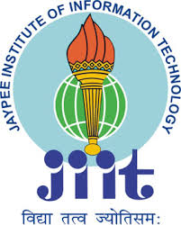

# NSS JIIT Noida-128
 

## National Service Scheme

## Introduction
**National Service Scheme**  (**NSS**) The National Service Scheme is an Indian government-sponsored public service program conducted by the Ministry of Youth Affairs and Sports of the Government of India. Popularly known as NSS, the scheme was launched in Gandhiji's Centenary year in 1969.

 
